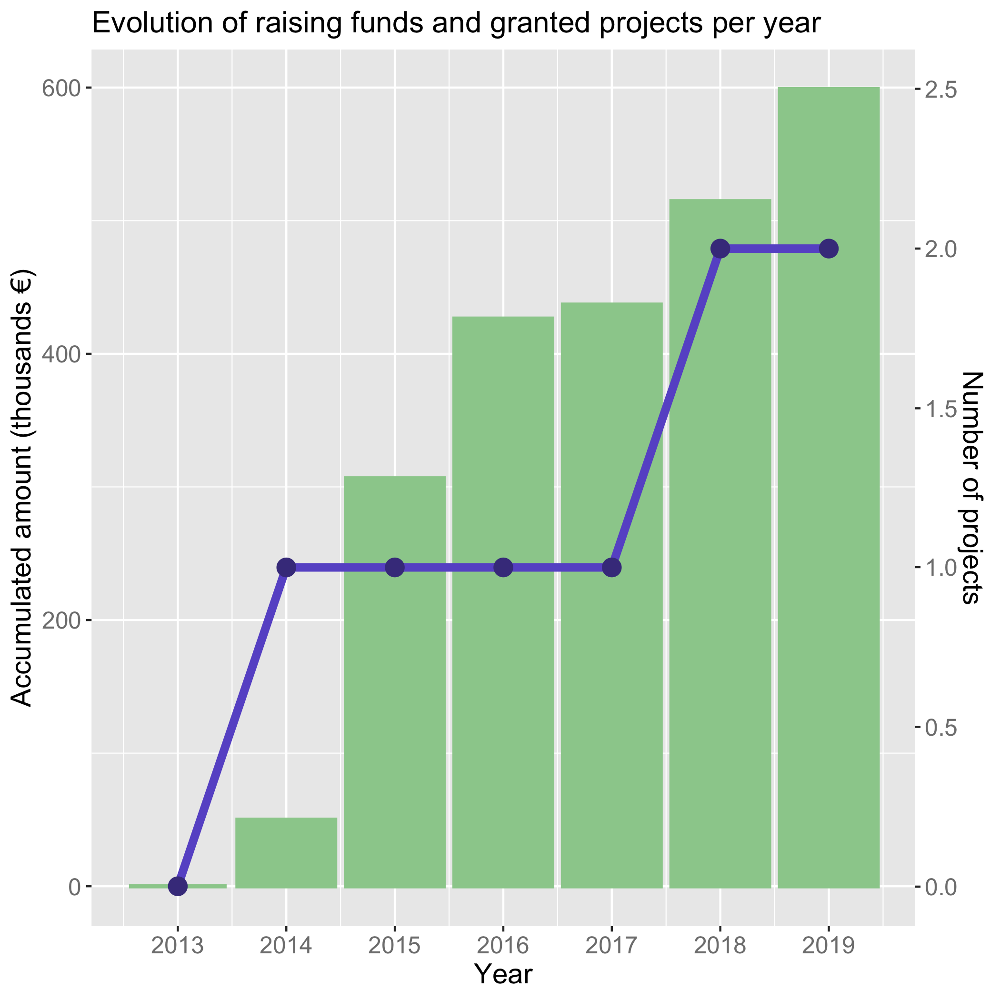
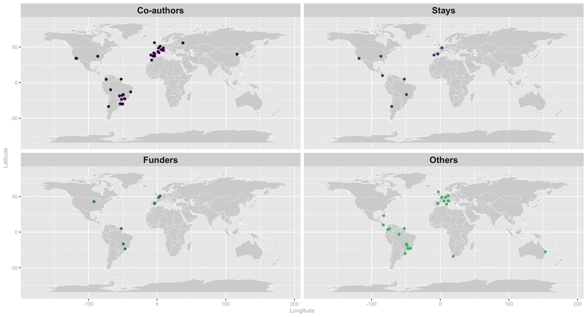
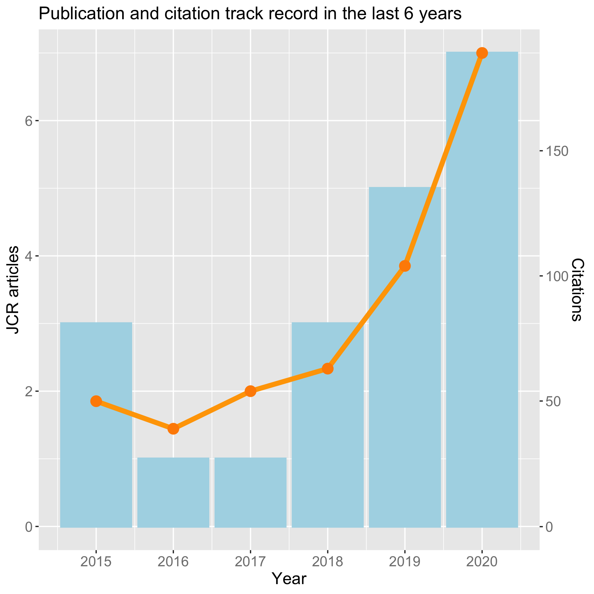
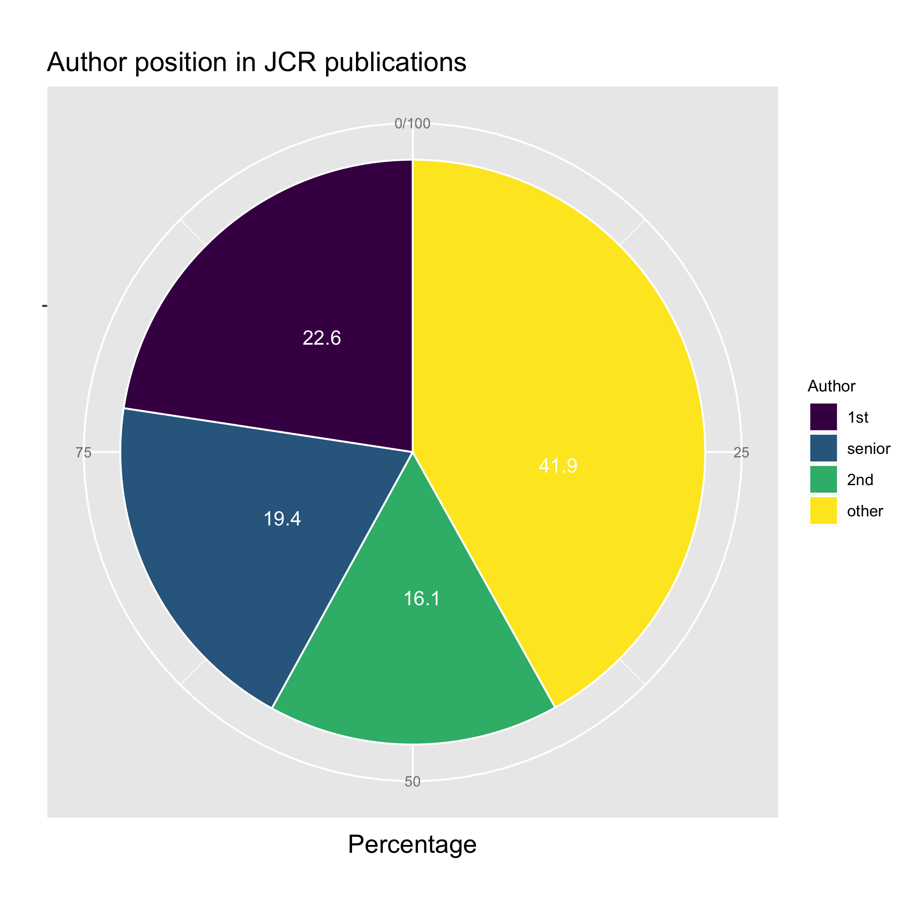
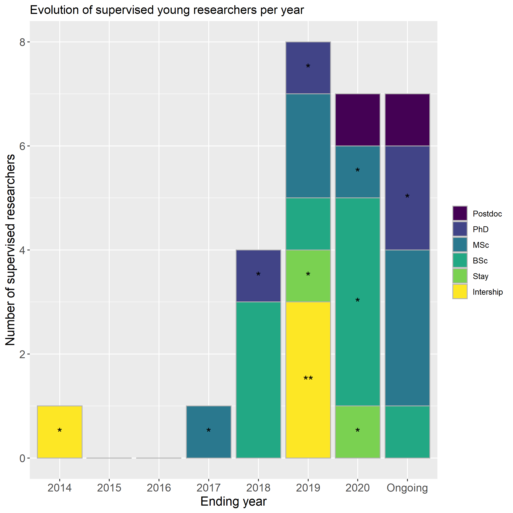
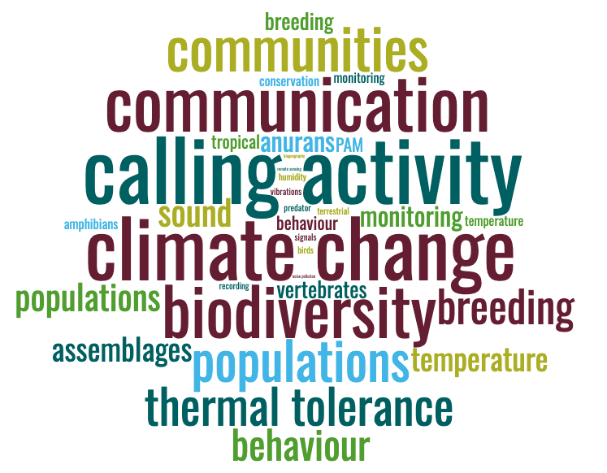

## Gráficas material suplementario

This is a document to present extra documents.......

```{r financiacion, out.width = "70%", out.height = "70%", fig.align = "left"}

```

<div id="fig-caption">
  <b>Supplementary Figure 1 -</b> Evolution of raising funds and granted projects per year...
</div>

```{r map3, out.width = "70%", out.height = "70%", fig.align = "left"}

```
<div id="fig-caption">
  <b>Supplementary Figure 2 -</b> mapa...
</div>

```{r papers_cites, out.width = "70%", out.height = "70%", fig.align = "left"}

```
<div id="fig-caption">
  <b>Supplementary Figure 3 -</b> papers...
</div>

```{r pie_author, out.width = "70%", out.height = "70%", fig.align = "left"}

```
<div id="fig-caption">
  <b>Supplementary Figure 4 -</b> author...
</div>

```{r sara_es_maravillosa, out.width = "70%", out.height = "70%", fig.align = "left"}

```
<div id="fig-caption">
  <b>Supplementary Figure 5 -</b> sara es maravillosa...
</div>

```{r wordcloud_v2_abstracts, out.width = "70%", out.height = "70%", fig.align = "left"}

```
<div id="fig-caption">
  <b>Supplementary Figure 6 -</b> wordcloud_v2_abstracts.png...
</div>